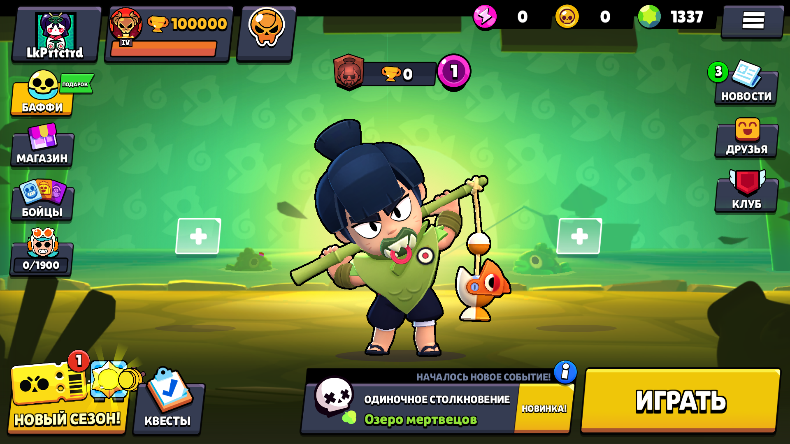

# BSL.v68
C Sharp Brawl Stars server emulator for version 68

## How to play: ##

### Server ###
1: Download the server and extract it: https://github.com/LkPrtctrd/BSL.v68/archive/refs/heads/master.zip

2: Open terminal on your computer and go to server directory.

3: Install .NET 8 and type "cd BSL.v68 && dotnet run" (or use programs like visual studio)

4: Follow client instructions

### Android Client ###
1: [Download the APK here](https://mega.nz/file/PBkiXADK#eHXCPuTD8BPSDHNOJ2up__OKhzOIuXiL3Dp2DcJUbxg)

2: Change redirectHost (also redirectPort and offlineBattles if you need it) in the frida config (lib/arm64-v8a/libBSL.c.so)

3: Enjoy playing BSL.v68!

## Screenshots ##

